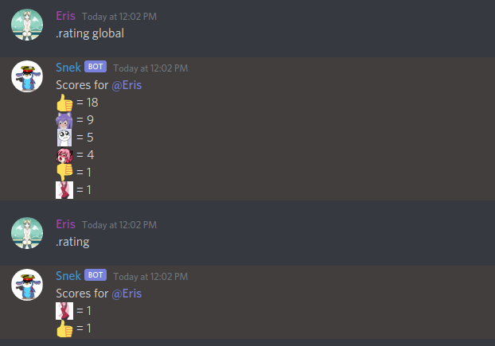
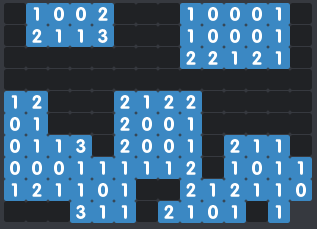
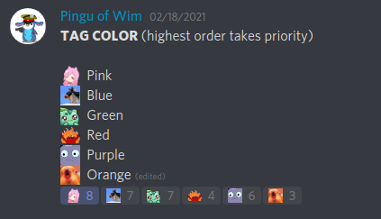
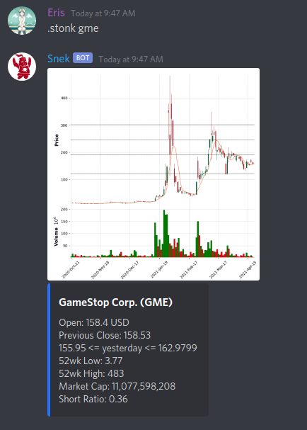
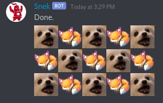

# Eris' Cogs
Welcome to my cogs! If you have any questions please [join my discord!](http://discord.gg/ee3NyDq)

The table below lists all available cogs, as well as their current state. If a cog is listed as 'not ready' that simply means that I haven't gone through to productionalize / standardize the code. They still work, I just haven't cleaned them up entirely yet. Use at your own risk!

If you're on windows, you'll need to delete the symlinked `eris_event_lib.py` files in the directories of the cogs you wish to install and replace it with a copy of the root-level file.

| Cog Name | Short | Ready? |
| --- | --- | --- |
| [Alot](#alot) | Posts an alot | ✅ |
| [Autoreact](#autoreact) | Adds reactions to posts! | ✅ |
| [Big_name](#big_name) | Change a user's name regardless of permissions | ✅ |
| [Big_text](#big_text) | Make your message big and emoji-fied | ✅ |
| [Clone](#clone) | The bot takes on a user's name and avatar | ✅ |
| [Dice](#dice) | Improved dice roller. | ✅ |
| [Dm_role](#dm_role) | DM everyone with certain role | ✅ |
| [Event_config](#event_config) | Configure `on_message` events | ✅ |
| [Export_emoji](#export_emoji) | Bulk Emoji Export | ✅ |
| [Facts](#facts) | Provide random facts | ✅ |
| [Fires](#fires) | US Firemap | ✅ |
| [Goodbot](#goodbot) | Good Bot Emoji Tracker | ✅ |
| [Hotel_california](#hotel_california) | Role-based "punishment" for infractions on moderator whim. | ✅ |
| [Im_dad](#im_dad) | Replies Hi _ I'm Dad | ✅ |
| [Insult](#insult) | Insult users | ✅ |
| [Just_met_her](#just_met_her) | Just Met Her | ✅ |
| [Lifslastcall](#lifslastcall) | Lif's | ✅ |
| [Minesweeper](#minesweeper) | Generate solvable minesweeper boards. | ✅ |
| [Move](#move) | Move message to another channel | ✅ |
| [Nick_prefix](#nick_prefix) | Adds themed prefix to names | ✅ |
| [No_fuck_you](#no_fuck_you) | Replies 'no fuck you' | ✅ |
| [Out_of_context](#out_of_context) | Archives a channel of out of context quotes and then posts them randomly during conversation. | ✅ |
| [Quotes](#quotes) | Incorrect Quotes by ScatterPatter | ✅ |
| [Rock_and_stone](#rock_and_stone) | Deep Rock Galactic shouting | ✅ |
| [Rolerequest](#rolerequest) | Emoji-based Role Request | ✅ |
| [Sarcasm](#sarcasm) | Randomly mocks users | ✅ |
| [Say](#say) | Send messages as the bot | ✅ |
| [Search](#search) | Search the internet! | ✅ |
| [Spoop](#spoop) | Sneakily spoops users | ✅ |
| [Steve](#steve) | Provides LARGE pictures of Steve when asked | ✅ |
| [Stonks](#stonks) | A stock tracker using yahoofinance | ✅ |
| [Sudo](#sudo) | Warns when users say sudo | ✅ |
| [Timezone](#timezone) | US Timezone converter | ✅ |
| [Weave](#weave) | Create a mosaic of alternating emoji | ✅ |
| [Whois](#whois) | Whois for discord | ✅ |
| [Wiggler](#wiggler) | Adds random reactions to posts! | ✅ |
| [Zalgo](#zalgo) | Memes and replaces text. | ✅ |
| [Battle](#battle) | Battle with your users | ❌ |
| [Events](#events) | Silly bot behavior not activated by explicit commands | ❌ |
| [Grammar](#grammar) | Checks grammar of your users - load at your own risk | ❌ |
| [Notify](#notify) | None | ❌ |

## Alot
Short: Posts an alot

Description: Automatically posts an alot whenever a user says 'alot of things' instead of 'a lot of things'
## Autoreact
Short: Adds reactions to posts!

Description: Auto reacts to posts. Similar to wiggly
## Big_name
Short: Change a user's name regardless of permissions

Description: Change someone's name - who cares about permissions. Usage: `[p]big_name [User] [new name]`
## Big_text
Short: Make your message big and emoji-fied

Description: Usage: [p]big_text [ASCII message]
## Clone
Short: The bot takes on a user's name and avatar

Description: The bot takes on a specified user's name and avatar. Users take 1d10 confusion damage, half as much on a successful save. Usage: [p]clone [User]
## Dice
Short: Improved dice roller.

Description: Improved dice roller, can support arbitrary dice. Usage regex: [p]dice #d#(v#)?
## Dm_role
Short: DM everyone with certain role

Description: DMs everyone with a specific role based on fuzzy role name
## Event_config
Short: Configure `on_message` events

Description: Configure `on_message` events, specifically which servers they appear in, which channels, etc. for Eris Cogs. By default, global events are on, guild-events are off. You'll need to run `[p]econf enable` in the guild you want events to run in.
## Export_emoji
Short: Bulk Emoji Export

Description: Bulk exports emoji for slack
## Facts
Short: Provide random facts

Description: Provides bear or snake facts based on user input or randomly.
## Fires
Short: US Firemap

Description: Show US Firemap
## Goodbot

Short: Good Bot Emoji Tracker

Description: Good Bot Emoji Tracker - tracks all emoji reactions (that the bot has access to) for all users in your server! Upon reaching a vote-threshold, replies to the original message and compliments the user!
## Hotel_california
Short: Role-based "punishment" for infractions on moderator whim.

Description: Role based "punishment". Allows users to punish via assigning roles.
## Im_dad
Short: Replies Hi _ I'm Dad

Description: Replies with Hi _ I'm Dad when someone says that they're _
## Insult
Short: Insult users

Description: Insults users via tagging.

Usage: `[p]insult user`

 Includes NSFW insults
## Just_met_her
Short: Just Met Her

Description: Replies with '_______________, I just met her!'
## Lifslastcall
Short: Lif's

Description: Lifs Last Call flowchart
## Minesweeper

Short: Generate solvable minesweeper boards.

Description: Generates guaranteed solvable minesweeper boards using emojis and spoilers.
## Move
Short: Move message to another channel

Description: Moves message to another channel for easy moderation.
## Nick_prefix
Short: Adds themed prefix to names

Description: Theme your nickname, some include NSFW language and themes.
## No_fuck_you
Short: Replies 'no fuck you'

Description: Replies with 'no fuck you' if someone says 'fuck you'
## Out_of_context
Short: Archives a channel of out of context quotes and then posts them randomly during conversation.

Description: Archives a channel of out of context quotes. Posts quotes randomly or in response to commands. Quotes must be in quotation marks to be archived. Usage: [p]penny
## Quotes
Short: Incorrect Quotes by ScatterPatter

Description: Generates fun short stories between users. Usage: `[p]quote users` - all credit to https://incorrect-quotes-generator.neocities.org/
## Rock_and_stone
Short: Deep Rock Galactic shouting

Description: Shouts various rock and stone quotes from Deep Rock Galactic
## Rolerequest

Short: Emoji-based Role Request

Description: Emoji-based role request for user roles.
## Sarcasm
Short: Randomly mocks users

Description: Sarcasm Module - randomly mocks users
## Say
Short: Send messages as the bot

Description: Users with mod status can command the bot to say anything in a certain channel.

Usage `[p]say guild channel ...message`
## Search
Short: Search the internet!

Description: Search the internet for useful info. Currently only wikipedia supported.
## Spoop
Short: Sneakily spoops users

Description: Sneakily spoops a user randomly or on mod prompting. NSFW spoops!
## Steve
Short: Provides LARGE pictures of Steve when asked

Description: If users ask variations on "Where's Steve?" the bot will post several LARGE pictures of steve. Small chance for these photos to be in a random order.
## Stonks

Short: A stock tracker using yahoofinance

Description: Displays current and historical stock information using the yahoo finance API
## Sudo
Short: Warns when users say sudo

Description: Replies in a channel if someone tries to use sudo - i.e. just uses the letters 'sudo'
## Timezone
Short: US Timezone converter

Description: Timezone converter! Switch between multiple US timezones easily
## Weave

Short: Create a mosaic of alternating emoji

Description: Create a mosaic of alternating specified emoji. Emojis may be animated or still. Usage: [p]weave emoji emoji width=5 height=3
## Whois
Short: Whois for discord

Description: Whois for server members. Set, update, and look up names to keep track of who is who. 

Usages: 

`[p]avatar member` - Posts a full resolution image of a specified user's profile picture

`[p]emoji emoji` - Posts a full resolution image of a specified emoji

`[p]whois member` - Look up name

`[p]theyare member name` - Set name 

`[p]iswho name` - Look up a username given their whois name 

`[p]iseveryone` - Lists all members of the server (without pinging!) and their whois names

`[p]import_whois` - privileged users can export a whois database. File to import should be attached to the command message.

`[p]export_whois` - Privileged users can export the whois DB to file
## Wiggler
Short: Adds random reactions to posts!

Description: Adds random reactions to posts! User configurable.

Usage:

`[p]wiggle set emojis...` - set list of random emoji to choose from.

`[p]wiggle show` - show your registered emoji

`[p]wiggle showall` - show all registered emoji (requires mod access)
## Zalgo
Short: Memes and replaces text.

Description: Memes the provided message and deletes the original.

Usage:

`[p]zalgo message` - [zalgo](https://knowyourmeme.com/memes/zalgo)

`[p]uwu message` - [uwu](https://knowyourmeme.com/memes/uwu)

`[p]oob message` - [oob](https://www.pinterest.com/pin/415879346839911237/)

`[p]spoilerify message` - spoilers every other word